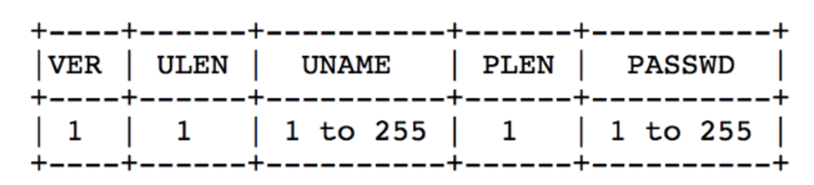
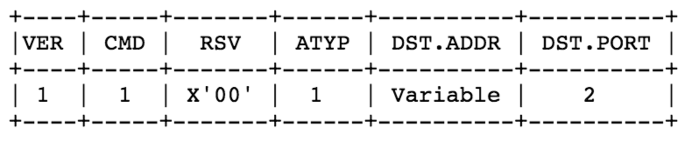

# socks5协议理解TCP/UDP
### socks5协议理解(TCP/UDP)


#### 1.socks 5 TCP认证
#####1.1 客户端建立连接并发送认证
创建与socks5服务器的TCP连接后，客户端要先发送请求来协商版本及认证方式：格式为：


* VER:socks的版本（socks5对应的是0x05）
* NMETHODS：在METHODS字段中出现的方法的数目.
* METHODS：客户端支持的认证方式列表，每个方法占1字节。
对应的代码：
```
struct sock5req1
{
	char Ver;
	char nMethods;
	char Methods[255];
};
sock5req1 *m_proxyreq1;
m_proxyreq1->Ver = SOCKS_VER;				// V 5.      [版本]
m_proxyreq1->nMethods = 2;						// 2 种验证方式[方法的数目]
m_proxyreq1->Methods[0] = METHOD_AUTH_NO;		// X'00'  不需要认证 [方法1]
m_proxyreq1->Methods[1] = METHOD_AUTH;			// X'02'  用户名/密码[方法2]
```
##### 1.2 服务器返回确认信息


* VER：socks版本（在socks5中是0x05）；
* METHOD：服务端选中的方法（若返回0xFF表示没有方法被选中，客户端需要关闭连接）；
```
struct sock5ans1
{
	char Ver;
	char Method; //METHOD_AUTH_NO   METHOD_AUTH
};
```
如果是需要用户名密码认证，则发送用户名密码。



* VER：鉴定协议版本
* ULEN：用户名长度
* UNAME：用户名
* PLEN：密码长度
* PASSWD：密码

服务器鉴定完之后，返回：


* VER：鉴定协议版本
* STATUS：鉴定状态
* 其中鉴定状态 0x00 表示成功，0x01 表示失败。

#### 2.socks5 udp认证


##### 2.1 获取UDP穿透地址和端口



* ver:socks5
* CMD:0X03表示UDP
* RSV: 0x00
* ATYP: 0x01(ipv4), 0x04（ipv6）
* DST.ADDR： 0x00（没用）
* DST.PORT:  客户端的UDP端口
```
struct sock5udpreq2
{
	char	Ver;
	char	Cmd;
	char	Rsv;
	char	Atyp;
	DWORD	dwReserve;
	WORD	wLocalPort;
};
```
##### 2.2 socks5服务端回复协议


```
struct sock5udpans2
{
	char	Ver; //0x05
	char	Rep;  //0x00-》succeed
	char	Rsv;  // X'00'
	char	Atyp;  //1（ipv4）
	DWORD	dwServerIp; //用于和udp通信的ip
	WORD	wServerPort; //用于和udp通信的port
};
```

得到UDP的穿透地址和端口后，就是传统的UDP通信，把信息发送到穿透地址和穿透端口后，socks5服务器就会自动的把信息转发到目的ip和目的端口上。
#### 3.需要注意的
* 1.这条TCP不能断，虽然说已经不传输数据了，但是一断就会导致UDP失效。
* 2.每一条UDP 都要创建一个tcp进行通信验证。如果有很多的话，可能会使得服务器压力很大。

#### 5.参考连接：
官方协议：https://www.ietf.org/rfc/rfc1928.txt
https://blog.csdn.net/liujiayu2/article/details/51691778
