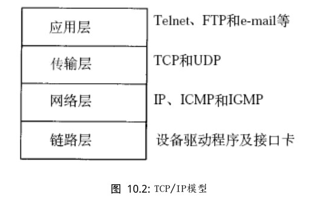
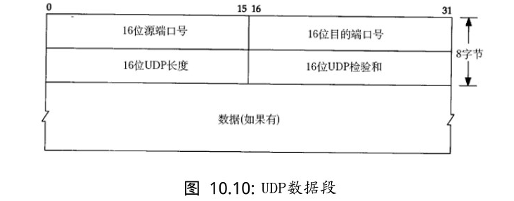

###1.模型
#### 1.1OSI七层模型


1.物理层：主要定义物理设备标准，如网线的接口类型、光纤的接口类型、各种传输介质的传输速率等。它的主要作用是传输比特流(就是由1、0转化为电流强弱来进行传输，到达目的地后再转化为1、0，也就是我们常说的数模转换与模数转换)。这一层的数据叫做比特。
2.数据链路层：定义了一种传输格式（以太网），定义了如何让格式化数据以进行传输，以及如何让控制对物理介质的访问。这一层通常还提供错误检测和纠正，以确保数据的可靠传输。
3.网络层：描述的是ip协议，相当于一个货车。在位于不同地理位置的网络中的两个主机系统之间提供连接和路径选
择
4.传输层：tcp/udp定义了一些传输数据的协议和端口号(WWW端口80等)，如：TCP(传输控制协议，传输效率低，可靠性强，用于传输可靠性要求高，数据量大的数据)，UDP(用户数据报协议，与TCP特性恰恰相反，用于传输可靠性要求不高，数据量小的数据，如QQ聊天数据就是通过这种方式传输的）。 主要是将从下层接收的数据进行分段和传输，到达目的地址后再进行重组。常常把这一层数据叫做段。
#### 1.2.一般开发程序员讨论最多的是TCP/IP模型


### 2.协议格式
#### 2.1. 数据包封装,进行层层加包头的方式。我们把它叫做TCP/IP协议栈。


#### 2.2 以太网帧格式
其中的原地址和目的地址指的是网卡地址（也叫做MAC地址），长度是48位，是在网卡出厂时固化的。用ifconfig命令看一下，“HWaddr 00:15:F2:14:9E:3F”部分就是硬件地址。协议字段有三种值，分别对应IP、ARP、RARP。帧末尾是CRC校验码。


以太网帧中的数据长度规定最小46字节，最大1500字节，ARP和RARP数据包的长度不够46字节，要在后面补填充位。最大值1500称为以太网的最大传输单元（MTU），不同的网络类型有不同的MTU，如果一个数据包从以太网路由到拨号链路上，数据包长度大于拨号链路的MTU了，则需要对数据包进行分片（fragmentation）。ifconfig命令的输出中也有“MTU:1500”。注意，MTU这个概念指数据帧中有效载荷的最大长度，不包括帧首部的长度。

#### 2.3 ARP数据包格式
ARP协议规定时28个字节。（最重要的是后面20个字节）MAC地址有两份，前面这一部分是用与在局域网中进行检验（如果你的MAC地址全部为FFFFF，就丢弃），后面的是ARP协议扫描获取到的MAC地址。


在网络通讯的时候，发送一个ARP的广播包，源主机的应用程序知道目的主机的IP地址和端口号，却不知道目的主机的硬件地址。而数据包首先是被网卡接收到再去处理上层协议的，如果接收到的数据包的硬件地址与本机不符合，则直接丢弃。因此在通讯前必须获取目的主机的硬件地址。    ARP协议就是这个作用。


发送ARP前，开始不知道对方的MAC地址，则填充为FFFFFFFF，发送到一个局域网内后，各个电脑进行解析，发现ip和自己相同的电脑，则填充自己的MAC地址，将这个ARP包再一次发到局域网内。这时候对比源MAC地址，不一样的MAC地址则扔掉。找对对应的发送电脑的MAC地址的电脑。
当在互联网上时，其实是获取的每个路由器的MAC地址。路由器从ARP包中获取目的IP地址后，将包转发到下一个路由器。
ip就类似于运输，tcp/udp就类似于投递（投递到指定的端口）
#### 2.4UDP数据包格式(TCP和UDP中包含了端口号)


#### 2.5.IP段格式


ip头部至少是20个字节，但是由图中的选项知道，其长度是可以变得(最长可以到60个字节)。4位版本指的是IPV4/IPV6,16位总长度指的是报的总长度。在IP包里面封装了源IP和目的IP。当获取到了MAC地址后，以太网帧格式中就封装了IP数据段。


#### 2.6.TCP数据包格式


首先是端口号，32为序号（发送端的序号，类似于下面的1000,8000）和32位确认序号（回复的确认信号）。请求建立连接SYN,关闭连接FIN，当一端出现异常时触发RST.
**TCP建立连接的过程**


**三次握手**
在TCP/IP协议中，TCP协议提供可靠的连接服务，采用三次握手建立一个连接。
第一次握手：建立连接时，客户端发送syn包(syn=j)到服务器，并进入SYN_SEND状态，等待服务器确认；
第二次握手：服务器收到syn包，必须确认客户的SYN（ack=j+1），同时自己也发送一个SYN包（syn=k），即SYN+ACK包，此时服务器进入SYN_RECV状态； 第三次握手：客户端收到服务器的SYN＋ACK包，向服务器发送确认包ACK(ack=k+1)，此包发送完毕，客户端和服务器进入ESTABLISHED状态，完成三次握手。 完成三次握手，客户端与服务器开始传送数据.

**数据传输**
1.发送1001包，携带了20个字节。ACK8001有两层含义：第一个是8000的包已经接受成功，第二个含义是请求8001包。
2.服务器端回复8001的包携带10个字节，发送1021的ACK包，表示刚才的20个字节，已经接受成功。
3.客户端在继续发送8011,如此循环
**四次挥手**
1.客户端发送一个FIN包，服务器返回给ACK的包，表示服务器已经知道了你已经要断开。
2.服务器端发送FIN的包，客户端回复应答包ACK，成功断开。


### 3.名词术语解释：
#### 3.1 路由器
> 在计算机网络中，路由表是一个存储在路由器或者联网计算机中的电子表格，路由表存储着指向特定网络地址的路径。
> 在ip协议中有一个8位生存时间（TTL），称为一跳，数据包在互联网上是有生命周期的，即TTL(256)，每跳一个路由器时，TTL减1，当减为0的时候，丢掉这个包。

#### 3.2 路由器和交换机
路由器时通过ip地址来转发数据，交换机是通过MAC地址来交换数据（工作在数据链路层）。
路由器工作于OSI七层协议中的第三层（网络层），主要任务是接收来自一个网络接口的数据包，根据其中所含的目的地址，决定转发到下一个目的地址。因此，路由器首先得在转发路由表中查找它的目的地址，若找到了目的地址，就在数据包的帧格前添加下一个MAC地址，同时IP数据包头的TTL（Time To Live）域也开始减数， 并重新计算校验和。当数据包被送到输出端口时，它需要按顺序等待，以便被传送到输出链路上。

####3.3 MTU
通信术语：最大传输单元，是一种通信协议的某一层所能通过的最大数据包大小（以字节为单位），最大传输单元这个参数通常与通信接口有关。
以下是一些协议的MTU
```
FDDI协议：4352字节
以太网（Ethernet）协议：1500字节
PPPoE（ADSL）协议：1492字节
X.25协议（Dial Up/Modem）：576字节
Point-to-Point：4470字节
```

###4.局域网内如何通信：
ARP去获取到你的MAC地址，在以太网侦协议中封装了对方的MAC地址，当局域网内的电脑在网卡层面发现和自己的MAC地址相同时，传递给内核协议栈，cpu介入。

**公网 上如何通信（路由器的NET技术），穿透打洞**


在路由器的内部有一个NAT映射，将局域网的地址转化成一个公网的IP。
PC1和C1要通信的时候，都要去server那边注册（要通过中间的路由器），server会记录pc1的公网的IP和端口。同样的记录c1的公网IP和端口号。
