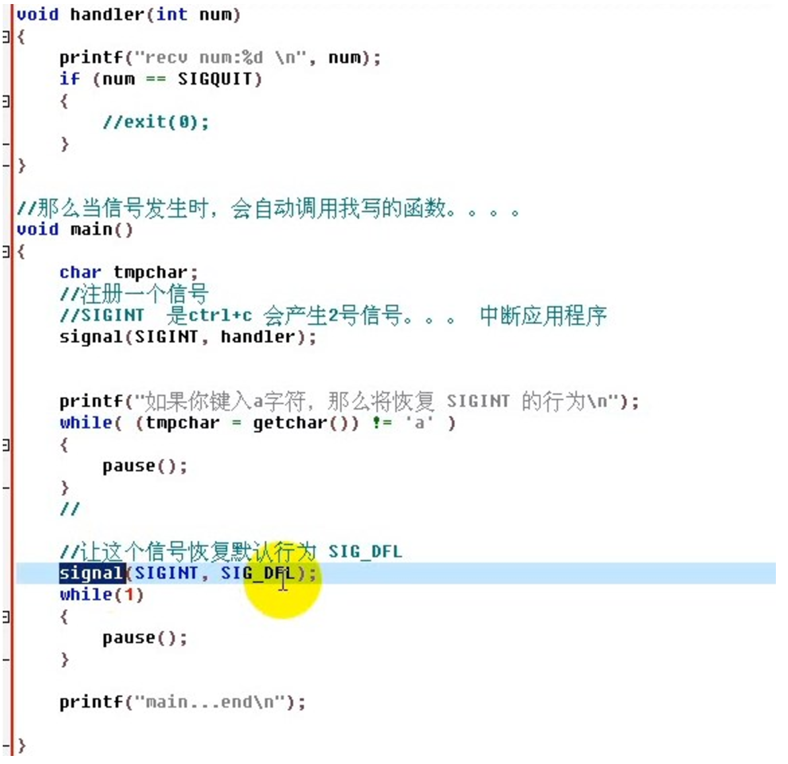

# linux系统编程-信号
## Linux系统编程-信号基本知识

### 1.信号的基本知识
```
信号名称	描述
SIGABRT	进程停止运行 6
SIGALRM	警告钟
SIGFPE	算述运算例外
SIGHUP	系统挂断
SIGILL	非法指令
SIGINT	终端中断  2
SIGKILL	停止进程(此信号不能被忽略或捕获)
SIGPIPE	向没有读者的管道写入数据
SIGSEGV	无效内存段访问

SIGQUIT	终端退出   3
SIGTERM	终止
SIGUSR1	用户定义信号1
SIGUSR2	用户定义信号2
SIGCHLD	子进程已经停止或退出  
SIGCONT	如果被停止则继续执行
SIGSTOP	停止执行
SIGTSTP	终端停止信号
SIGTOUT	后台进程请求进行写操作
SIGTTIN	后台进程请求进行读操作
```
###2.进程对信号的三种响应
* 1.忽略信号
	* 不采取任何操作、有两个信号不能被忽略：SIGKILL（9号信号）和SIGSTOP。
	* 为什么进程不能忽略SIGKILL、SIGSTOP信号。（如果应用程序可以忽略这2个信号，系统管理无法杀死、暂停进程，无法对系统进行管理。）。SIGKILL（9号信号）和SIGSTOP信号是不能被捕获的。
* 2.捕获并处理信号
* 3.执行默认操作 （信号的默认操作：通过 man 7 signal 进程查看）

### 3.signal函数的作用
* 1.站在应用程序的角度，注册一个信号处理函数。
* 2.忽略信号、设置信号默认处理 信号的安装和恢复
```
__sighandler_t signal(int signum, __sighandler_t handler);
1.signal是一个带signum和handler两个参数的函数，准备捕捉或屏蔽的信号由参数signum给出，接收到指定信号时将要调用的函数由handler给出.
2.handler这个函数必须有一个int类型的参数（即接收到的信号代码），它本身的类型是void
3.handler也可以是下面两个特殊值：
           SIG_IGN  屏蔽该信号
           SIG_DFL  恢复默认行为
```
案例（信号的安装与恢复）


### 3.signal函数的返回值
```
//测试函数返回值
void main23()
{
    char tmpchar;
    //注册一个信号
    //SIGINT  是ctrl+c 会产生2号信号。。。 中断应用程序
    __sighandler_t old = signal(SIGINT, handler);
    if (SIG_ERR == old)
    {
        perror("signal err"); //errno
    }
    printf("如果你键入a字符，那么将恢复 SIGINT 的行为\n");
    while( (tmpchar = getchar()) != 'a' )
    {
        pause();
    }

    //让这个信号恢复默认行为 SIG_DFL
    signal(SIGINT, old);
    while(1)
    {
        pause();
    }

    printf("main...end\n");    
}
```
项目开发中的写法
```
//测试函数返回值
void main()
{
    char tmpchar;
    //注册一个信号
    //SIGINT  是ctrl+c 会产生2号信号。。。 中断应用程序
     if (signal(SIGINT, handler) == SIG_ERR)
     {
             perror("signal err"); //errno
             exit(0);
     }
    while(1)
    {
        pause();
    }

    printf("main...end\n");

}  
```
### 4.信号的发送(如果在fork之前安装信号，则子进程可以继承信号。)
发送信号的函数有kill和raise
区别：kill既可以向自身发送信号，也可以向其他进程发送信号；
raise函数向进程自身发送信号。
Int kill(pid_t pid, int siq)
int raise(int signo)
```
Int kill(pid_t pid, int siq)
参数组合情况解释：
kill(pid_t pid, int siq)
pid>0 将信号sig发给pid进程
pid=0 将信号sig发给同组进程
pid=-1 将信号sig发送给所有进程，调用者进程有权限发送的每一个进程（除了1号进程之外，还有它自身）
pid<-1 将信号sig发送给进程组是pid（绝对值）的每一个进程
```
### 5.sleep函数
1）sleep函数作用，让进程睡眠。
2）能被信号打断，然后处理信号函数以后，就不再睡眠了。直接向下执行代码
3）sleep函数的返回值，是剩余的秒数
```
 23 void handle(int num)
 24 {
 25     printf("rec num:%d\n",num);
 26 }
 27 int main()
 28 {
 29     int n = 10;
 30
 31     signal(SIGINT,handle);
 32     do
 33     {
 34         n=sleep(n);
 35         printf("jixu  sleep\n");
 36
 37     }while(n>0);
 38
 39 }
```
### 6.alarm函数
alarm函数，设置一个闹钟延迟发送信号
告诉linux内核n秒中以后，发送SIGALRM信号；
```
void  myhandle(int num)
{
	printf("recv signal id num : %d \n", num);
	//kill -alram ` ps -aux | grep 01aram | grep -v vi | awk '{print $2}' `
	alarm(1);
}

int main(void)
{
	printf("main ....begin\n");
	//注册信号处理函数
	if (signal(SIGALRM, myhandle) == SIG_ERR)
	{
		perror("func signal err\n");
		return 0;
	}
	alarm(1);
	while(1)
	{
		pause();
		printf("pause return\n");
	}
	return 0;
}
```
### 7.信号处理函数遇上可重入函数和不可重入函数
可重入函数概念 ：
* 1.为了增强程序的稳定性，在信号处理函数中应使用可重入函数。
* 2.所谓可重入函数是指一个可以被多个任务调用的过程，任务在调用时不必担心数据是否会出错。因为进程在收到信号后，就将跳转到信号处理函数去接着执行。如果信号处理函数中使用了不可重入函数，那么信号处理函数可能会修改原来进程中不应该被修改的数据，这样进程从信号处理函数中返回接着执行时，可能会出现不可预料的后果。不可再入函数在信号处理函数中被视为不安全函数。
* 3.满足下列条件的函数多数是不可再入的：
	* 使用静态的数据结构，如getlogin()，gmtime()，getgrgid()，getgrnam()，getpwuid()以及getpwnam()等等。
	* 函数实现时，调用了malloc（）或者free()函数。
	* 实现时使用了标准I/O函数的 。

**在信号处理函数中，尽量不使用全局变量和静态变量的函数。特别是这个变量在程序中随时读写。**
