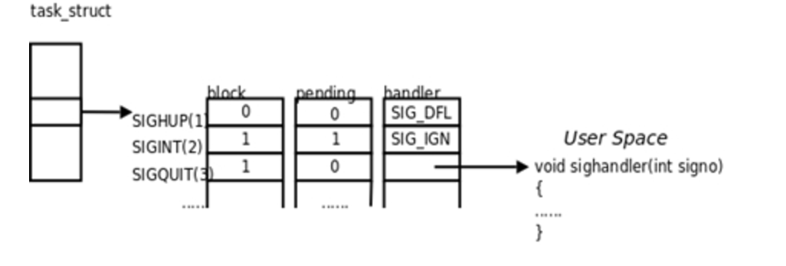
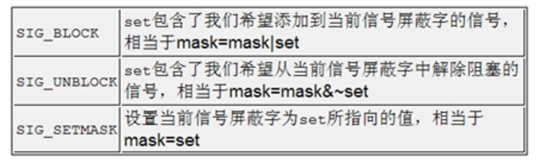

# linux系统编程-信号

## 信号的状态和操作函数
#### 1.信号的阻塞和未达
信号在内核中的表示：
执行信号的处理动作称为信号递达（Delivery），信号从产生到递达的之间状态，称为信号未决（Pending）。进程可以选择阻塞（Block）某个信号。被阻塞的信号产生时将保持在未决状态，直到进程解除对此信号的阻塞，才执行递达的动作。
注意：
阻塞和忽略是不同，只要信号被阻塞就不会递达，而忽略是在递达之后可选的一种处理动作。信号在内核中的表示可以看作是这样的：



说明1）PCB进程控制块中函数有信号屏蔽状态字（block）信号未决状态字（pending）还有是否忽略标志；

说明2）信号屏蔽状态字（block），1代表阻塞、0代表不阻塞；信号未决状态字（pending）的1代表未决，0代表信号可以抵达了；

说明3）向进程发送SIGINT，内核首先判断信号屏蔽状态字是否阻塞，信号未决状态字（pending相应位制成1；若阻塞解除，信号未决状态字（pending）相应位制成0；表示信号可以抵达了。

说明4）block状态字、pending状态字 64bit；

说明5）block状态字用户可以读写，pending状态字用户只能读；这是信号设计机制。

思考1：状态字都64bit，编程时，如何表示状态字那？

思考2：block状态字信息如何获取或者操作那？哪些api？

思考3：pending状态字信息如何获取或者操作那？哪些api？

#### 2.信号集操作函数
```
信号集操作函数（状态字表示）
 #include <signal.h>
 int sigemptyset(sigset_t *set);8个字节的buf,把buf清零
 int sigfillset(sigset_t *set); 把8个字节全部职位1
 int sigaddset(sigset_t *set, int signo); 根据signo，把信号集中的对应为置成1
 int sigdelset(sigset_t *set, int signo); 根据signo，把信号集中的对应为置成0
 int sigismember(const sigset_t *set, int signo);//判断signo是否在信号集中
```
#### 3.读取或者更改进程的信号屏蔽状态字(block)
1、```int sigprocmask(int how, const sigset_t *set, sigset_t *oset);```
2、功能：读取或更改进程的信号屏蔽字。
3、返回值：若成功则为0，若出错则为-1
4、如果oset是非空指针，则读取进程的当前信号屏蔽字通过oset参数传出。如果set是非空指针，则更改进程的信号屏蔽字，参数how指示如何更改。如果oset和set都是非空指针，则先将原来的信号屏蔽字备份到oset里，然后根据set和how参数更改信号屏蔽字。
假设当前的信号屏蔽字为mask，下表说明了how参数的可选值:
(mask=mask|set)指的是如果这个信号存在就不添加，不在的话就添加进去，或不会影响原来的位置情况



#### 4.获取信号未决状态字（pending）的信息
 int sigpending(sigset_t *set);

```
#include <unistd.h>
#include <sys/stat.h>
#include <sys/wait.h>
#include <sys/types.h>
#include <fcntl.h>
#include <stdlib.h>
#include <stdio.h>
#include <errno.h>
#include <string.h>
#include <signal.h>
//演示信号从产生到抵达的整个过程
//信号的阻塞和解除阻塞综合实验
//设置信号阻塞和非阻塞，设置ctl+q来解除信号阻塞
#define ERR_EXIT(m) \
    do \
    { \
        perror(m); \
        exit(EXIT_FAILURE); \
    } while(0)
void handler(int sig);
void handler(int sig)
{
    if (sig == SIGINT)
    {
        printf("recv a sig=%d\n", sig);
        printf("\n\n\n");
        //fflush(stdout);
    }
    else if (sig == SIGQUIT)
    {
        sigset_t uset;
        sigemptyset(&uset);
        sigaddset(&uset, SIGINT);
        //ctr + \ 用来接触  SIGINT 信号
        //解除阻塞
        sigprocmask(SIG_UNBLOCK, &uset, NULL);

        //signal(SIGINT, SIG_DFL) ;
    }
}
void printsigset(sigset_t *set)
{
    int i;
    for (i=1; i<NSIG; ++i)
    {
        if (sigismember(set, i))
            putchar('1');
        else
            putchar('0');
    }
    printf("\n");
}
//测试显示 信号未达状态 关键字
int main01(int argc, char *argv[])
{
    sigset_t pset;

    //sigset_t bset;
    //sigemptyset(&bset);
    //sigaddset(&bset, SIGINT);
    //按照信号 信号因为没有阻塞直接抵达


    /*
    if (signal(SIGINT, handler) == SIG_ERR)
        ERR_EXIT("signal error");
    */
        /*
    if (signal(SIGQUIT, handler) == SIG_ERR)
        ERR_EXIT("signal error");
        sigprocmask(SIG_BLOCK, &bset, NULL);
    */

    for (;;)
    {
        //获取信号未决  sigset_t字
        sigpending(&pset);
        //打印信号未决  sigset_t字
        //信号没有被阻塞，信号没有未决，所以没有东西
        printsigset(&pset);
        sleep(2);
    }
    return 0;
}
//测试显示 信号未达状态 关键字 + 注册SIGINT信号
int main02(int argc, char *argv[])
{
    sigset_t pset;

    //sigset_t bset;
    //sigemptyset(&bset);
    //sigaddset(&bset, SIGINT);
    //按照信号 信号因为没有阻塞直接抵达

    if (signal(SIGINT, handler) == SIG_ERR)
        ERR_EXIT("signal error");
        /*
    if (signal(SIGQUIT, handler) == SIG_ERR)
        ERR_EXIT("signal error");
        sigprocmask(SIG_BLOCK, &bset, NULL);
    */

    for (;;)
    {
        //获取信号未决  sigset_t字
        sigpending(&pset);
        //打印信号未决  sigset_t字
        //信号没有被阻塞，信号没有未决，所以没有东西
        printsigset(&pset);
        sleep(2);
    }
    return 0;
}
//3 连续的按ctrl+c键盘，虽然发送了多个SIGINT信号，但是因为信号是不稳定的，只保留了一个。
//不支持排队
int main(int argc, char *argv[])
{
    sigset_t pset; //用来打印的信号集
    sigset_t bset; //用来设置阻塞的信号集

    sigemptyset(&bset);
//把信号集相应位置成1
    sigaddset(&bset, SIGINT);//把64位的第二位置为1

    if (signal(SIGINT, handler) == SIG_ERR)
        ERR_EXIT("signal error");

    if (signal(SIGQUIT, handler ) == SIG_ERR)
        ERR_EXIT("signal error");
    //读取或更改进程的信号屏蔽字 这里用来阻塞ctrl+c信号
    //ctrl+c信号被设置成阻塞，即使用户按下ctl+c键盘，也不会抵达
    sigprocmask(SIG_BLOCK, &bset, NULL);

    for (;;)
    {
        //获取未决 字信息
        sigpending(&pset);

        //打印信号未决  sigset_t字
        printsigset(&pset);
        sleep(1);
    }
    return 0;
}
```
#### 5.sigaction函数
sigaction函数
1、包含头文件<signal.h>
 功能:sigaction函数用于改变进程接收到特定信号后的行为。
 原型：
2、```int  sigaction(int signum,const struct sigaction *act,const struct sigaction *old);```
参数
该函数的第一个参数为信号的值，可以为除SIGKILL及SIGSTOP外的任何一 个特定有效的信号（为这两个信号定义自己的处理函数，将导致信号安装错误）
第二个参数是指向结构sigaction的一个实例的指针，在结构 sigaction的实例中，指定了对特定信号的处理，可以为空，进程会以缺省方式对信号处理
第三个参数oldact指向的对象用来保存原来对相应信号的处理，可指定oldact为NULL。
返回值:函数成功返回0，失败返回-1


#### sigaction结构体
 第二个参数最为重要，其中包含了对指定信号的处理、信号所传递的信息、信号处理函数执行过程中应屏蔽掉哪些函数等等
```
struct sigaction {
void (*sa_handler)(int);   //信号处理程序 不接受额外数据
void (*sa_sigaction)(int, siginfo_t *, void *); //信号处理程序 能接受额外数据，和sigqueue配合使用
sigset_t sa_mask; //
int sa_flags; //影响信号的行为 SA_SIGINFO表示能接受数据
void (*sa_restorer)(void); //废弃
};
sa_flags中包含了许多标志位，包括刚刚提到的SA_NODEFER及SA_NOMASK标志位。另一个比较重要的标志位是SA_SIGINFO，当设定了该标志位时，表示信号附带的参数可以被传递到信号处理函数中，因此，应该为sigaction结构中的sa_sigaction指定处理函数，而不应该为sa_handler指定信号处理函数，否则，设置该标志变得毫无意义。即使为sa_sigaction指定了信号处理函数，如果不设置SA_SIGINFO，信号处理函数同样不能得到信号传递过来的数据，在信号处理函数中对这些信息的访问都将导致段错误

来源： <http://blog.163.com/zheng_he_xiang/blog/static/1865053262011631102123970/>

```
注意1：回调函数句柄sa_handler、sa_sigaction只能任选其一。

注意2：The sigaction structure is defined as something like 思考如何测试？

```
14 void handler2(int num, siginfo_t *info, void *p)
 15 {
 16     printf("recv sig:%d\n", num);
 17 }
 18 int main()
 19 {
 20     struct sigaction act;
 21     //act.sa_handler = handler;
        //注意这两个字段不能同时出现
 22     act.sa_sigaction = handler2;
 23
 24     sigaction(SIGINT, &act, NULL);
 25
 26     while(1)
 27     {
 28         sleep(1);
 29     }
 30     return 0;
 31 }
```

#### 6.sigqueue新的信号发送函数
功能:  新的发送信号系统调用,主要是针对实时信号提出的支持信号带有参数,与函数sigaction()配合使用。
int sigqueue(pid_t pid, int sig, const union sigval value);
参数
 sigqueue的第1个参数是指定接收信号的进程id，第2个参数确定即将发送的信号，第3个参数是一个联合数据结构union sigval，指定了信号传递的参数，即通常所说的4字节值。
返回值成功返回0,失败返回-1
sigqueue()比kill()传递了更多的附加信息，但sigqueue()只能向一个进程发送信号，而不能发送信号给一个进程组。
```         
union sigval {
               int   sival_int;
               void *sival_ptr;
           };
```
例子：
```
#include <unistd.h>
#include <sys/stat.h>
#include <sys/wait.h>
#include <sys/types.h>
#include <fcntl.h>

#include <stdlib.h>
#include <stdio.h>
#include <errno.h>
#include <string.h>
#include <signal.h>

#define ERR_EXIT(m) \
		do \
	{ \
				perror(m); \
				exit(EXIT_FAILURE); \
			} while(0)

//演示两个进程之间通过sigqueue发送数据
void  myHandle_forsigaction(int signum, siginfo_t *s_t, void *p)
{
	int myint = 0;
	printf("recv signum:%d\n",signum);
	myint = s_t->si_value.sival_int;
	printf("%d %d\n",myint, s_t->si_int);
}

int main(int argc, char *argv[])
{
	pid_t pid;
	int ret = 0;

	struct sigaction act;
	act.sa_sigaction = myHandle_forsigaction;
	sigemptyset(&act.sa_mask);

	//sa_flag和回调函数配合使用，准备接受数据
	act.sa_flags = SA_SIGINFO;

	if(sigaction(SIGINT, &act, NULL) < 0)
		ERR_EXIT("sigaction error");
	pid = fork();

	if(pid == -1)
	{
		printf("fork err...\n");
		return 0;
	}
	if(pid == 0)
	{
		union sigval mysigval;
		mysigval.sival_int = 222;

		ret = sigqueue(getppid(), SIGINT, mysigval);
		if (ret != 0)
		{
			printf("sigqueue...\n");
			exit(0);
		}
		else
		{
			printf("sigqueue...success\n");
			sleep(2);
		}
	}
	else if(pid > 0)
	{
		for(;;)
		{
			pause();
		}
	}
	return 0;
}

```
