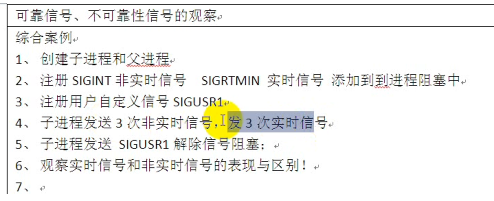

# 可靠信号和不可靠信号

自己修改为可以接受参数

```
 #include <unistd.h>
 #include <sys/stat.h>
 #include <sys/wait.h>
 #include <sys/types.h>
 #include <fcntl.h>

 #include <stdlib.h>
 #include <stdio.h>
 #include <errno.h>
#include <string.h>
#include <signal.h>

 #define ERR_EXIT(m) \
	          do \
	     { \
			  perror(m); \
			  exit(EXIT_FAILURE); \
		 } while(0)


void myhandle(int num)
{
	 if(num == SIGUSR1)
	 {
		sigset_t bset;
		sigemptyset(&bset);
		sigaddset(&bset, SIGINT);
		sigaddset(&bset, SIGRTMIN);

		sigprocmask(SIG_UNBLOCK, &bset, NULL);
		printf("解除阻塞 recv sig num:%d\n",num);
	 }
	 else if (num == SIGINT || num == SIGRTMIN)
	 {
		printf("recv sig num:%d\n",num);
	 }
	 else
	 {
		printf("其他信号recv:%d\n",num);
	 }

}

void main()
{
	pid_t pid;

	struct sigaction act;
	act.sa_handler = myhandle;
	act.sa_flags = SA_SIGINFO;
	//注册非实时信号处理函数
	if (sigaction(SIGINT, &act, NULL) < 0)
	{
		ERR_EXIT("sigactin err");
	}
	//注册实时信号处理函数
	if(sigaction(SIGRTMIN, &act, NULL) < 0)
	{
		ERR_EXIT("sigactin SIGRTMIN");
	}

	//注册用户自定义信号SIGUSR1
	if(sigaction(SIGUSR1, &act, NULL) < 0)
	  {
	         ERR_EXIT("sigactin SIGUSR1");

	  }


	//把SIGINT和SIGRTMIN添加到本进程的阻塞状态字
	sigset_t bset;
	sigemptyset(&bset);
	sigaddset(&bset, SIGINT);
	sigaddset(&bset, SIGRTMIN);

	sigprocmask(SIG_BLOCK, &bset, NULL);

	pid = fork();
	if(pid == -1)
	{
		ERR_EXIT("fork err\n");
	}
	if (pid == 0)
	{
		int i =  0;
		int ret = 0;
		union sigval v;
		v.sival_int = 201;
		//发3次不可靠信号
		for(i=0; i<3; i++)
		{
			ret = sigqueue(getppid(), SIGINT, v);
			if(ret != 0)
			{
				printf("发送不可靠信号失败ret : %d, errn0:%d\n",ret, errno);
				exit(0);
			}
			else
			{
				printf("sucess\n");
			}
		}

		//发3次稳定信号
		v.sival_int = 301;
		for(i=0; i<3; i++)
		{
			ret = sigqueue(getppid(), SIGINT, v);
			if(ret != 0)
			{
				printf("发送不可靠信号失败ret : %d, errn0:%d\n",ret, errno);
				exit(0);
			}
			else
			{
				printf("发送可靠信号sucesss\n");
			}
		}
		kill(getppid(), SIGUSR1);
	}
	while(1)
	{
		sleep(1);
	}

	printf("main.....\n");
}
```
