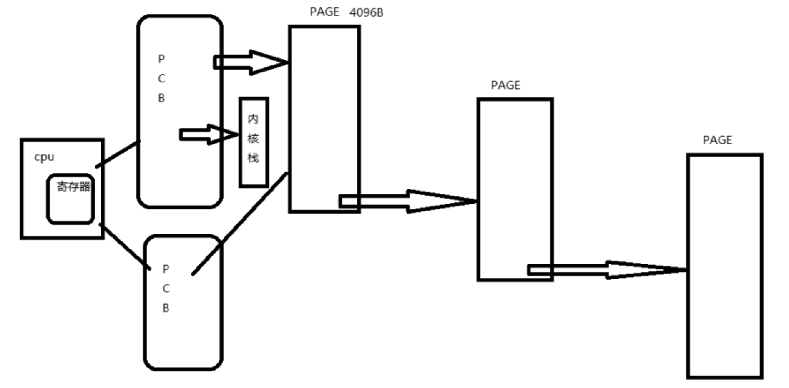
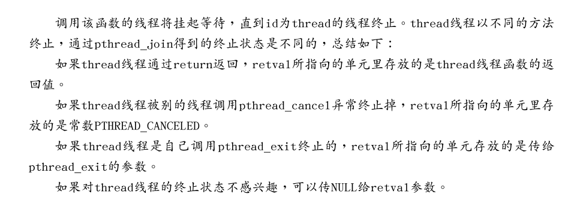

# linux系统编程-线程

## Linux线程基本概念

### 1.线程和进程的关系
1、线程也称为轻量级的进程，也有PCB，创建线程使用的底层函数和进程一样，都是clone。

2、从内核里看进程和线程是一样的，都有各自不同的PCB，但是PCB中指向内存资源的三级页表是相同的。(线程和进程共用了同一块地址空间)

3、在linux下，线程是最小的执行单位，进程是最小的分配资源单位（PCB）。

4、在美国人眼里，线程就是cpu和寄存器（每个线程有自己独立的内核栈，将寄存器的值保存在自己的内核栈中）





```
ps -eLf查看当前的线程，lpw字段表示的轻量级的进程
ps -Lw   3257查看某个具体进程中的线程
```

### 2.线程间共享资源
1、文件描述符表

2、每种信号的处理方式（知识处理方式）

3、当前的工作目录（如果一个线程改变了当前工作目录，其他的也会改变）

4、用户ID和组ID

5、内存地址空间
TEXT(代码段)，data（数据段，已经初始化的全局变量和已经初始化的静态变量），bss段（未初始化的全局变量和未初始化的静态变量），堆，共享库.

### 3.线程间非共享的资源：
1、线程id

2、处理器现场和栈指针（内核栈）

3、独立的栈空间（用户空间的栈）

4、errno变量（每个线程维护自己的errno变量）

5、信号屏蔽字段

6、调度优先级

### 4.线程优缺点
* 优点：
	* 提高程序的并发性
	* 开销小，不用重新分配内存
	* 通信和共享数据方便
* 缺点：
	* 线程不稳定（库函数实现）
	* 线程调试比较困难（gdb支持不好）
	* 线程无法使用unix事件，例如信号

### 5.线程原语
  #### 5.1 创建线程
  ```
  #include <pathread.h>
  int pathread_create(pathrad_t *thread,  const pathrad_attr_t *attr, void *(*start_routine)(void *),  void *arg);
  pathread_t  *thread: 传递一个pathread_t变量的地址进来，用于保存新线程的tid(线程ID)。
  const pathread_t *attr:线程属性设置，如使用默认属性，则传NULL。
  void  *(*start_routine)(void *):函数指针，指向新线程应该加载执行的函数模块。函数返回值必须是void * 类型
  void *arg:指定线程将要加载调用的那个函数的参数。给线程调用函数传递的参数。
  返回值：成功返回0，失败返回错误号。以前学过的系统函数都是成功返回0.失败返回-1，而错误号保存在全局变量errno中，而pthread库的函数都是通过返回值返回错误号，虽然每个线程也都是有一个errno,但这是为了兼容其他函数接口而提供的，pthread库本身并不使用它，通过返回值返回错误码更加清晰
  ```

  #### 5.2 获取调用线程的tid
  pathrad_create成功返回后，新创建的线程的id被填写到thread参数所指向的内存单元。我们知道进程id的类型是pid_t，每个进程的id在整个系统中是唯一的，调用getpid（）可以获得当前进程的id,是一个正整数值。线程id的类型是therad_t,它只在当前进程中保证是唯一的，在不同的系统中thread_t这个类型有不同的实现，它可能是一个正整数值，也可能是一个结构体，也可能是一个地址，所以不能简单的通过printf打印，调用pthrad_self()可以获得当前线程的id.
  pthread_self
  ```
  #include <pthrad.h>
  pthrad_t pthrad_self(void);
  ```
  #### 5.3.pthread_self获得tid和pthread_create函数里的tid是否会出现不一致？（会）
  ```
  #include <pthread.h>
  #include <stdio.h>

  void *th_fun( void *arg )
  {
  	int *p = ( int * )arg;
  	printf("thread PID = %d\n", getpid());
  	printf( "thread ID = %x\n",  ( unsigned int )pthread_self() );
  	printf( "thread *arg = %d\n ", *p);
  	while(1);
  }

  int main(void)
  {
  	pthread_t tid;
  	int n = 10;

  	err = pthread_create( &tid, NULL, th_fun, (void *)&n );
          strerror(err);//出错处理
          //分为3步：1.创建线程 2.线程号填写到tid 3.返回函数
  	//主线程里的pthread_create 返回值tid == 子线程里pthread_self()???
          printf("main child thread ID=%d\n", (unsigned int)tid);
  	printf( "main thread ID = %x\n", (unsigned int)pthread_self() );
  	printf( "main PID = %d\n", getpid());
  	while(1);
  	return 0;
  }
  ```
  **注：当主控线程退出时，会导致整个线程退出，所以加了while(1)保证子线程的执行，因为有可能是先执行主控线程，执行完就退出了**
  明确pthread_create函数所做的事情：
  1.创建线程。

  2、线程号填写到tid.

  3、返回给函数调用

  当创建完线程有可能去执行那个线程了，当这个线程执行完之后，再把线程号填写到tid的时候，是没有意义的。

  #### 5.4.线程的退出
  如果任意一个线程调用了exit或_exit,则整个进程的所有线程都终止，在main函数return也相当于调用exit。
  线程退出函数:pthread_exit
  >* 只是释放当前的线程，不会释放掉整个进程。
  * 需要注意的是，pthread_exit和return返回的指针所指向的内存单元必须是全局的或者是用malloc分配的，不能在线程函数的栈上分配，因为当其他线程得到这个返回指针的时候线程函数已经退出了。

  ```
  #include <pthread.h>
  void pthread_exit(void *retval);
  void *retval:线程退出时传递的参数，可以是退出值或地址，如果是地址，不能是线程内部申请的局部地址
  ```


#### 5.5pathred_join(类似于进程的wait)
```
int pthread_join(pthread_t thread,  void **retval);
pthread_t thread:回收线程的tid
void **retval：接收退出线程传递出的返回值（接收pthread_exit()函数的退出值）
返回值：成功返回0，失败返回错误号
释放进程的资源（PCB等）
```



#### 5.6 pthread_cancel
在进程内某个函数可以取消另一个线程
```
int pthread_cancel(pthread_t thread)
```
被取消的线程，退出值定义在linux的pthread库中常数THREAD_CANCELED的值是-1.

综合的例子：
```
#include <stdio.h>
#include <stdlib.h>
#include <pthread.h>
#include <unistd.h>

void *thr_fn1 (void *arg)
{
	printf("thread 1 returning\n");
        //把1的地址强制转化为void *型
	return (void *)1;
}
void *thr_fn2 (void *arg)
{
	printf("thread 2 exiting\n");
	pthread_exit((void *)2);
}
void *thr_fn3 (void *arg)
{
	while(1)
	{
		printf("thread 3 writing\n");
		sleep(1);
	}
}

int main(void)
{
	pthread_t tid;
	void *tret;

	pthread_create(&tid, NULL, thr_fn1, NULL);
	pthread_join(tid, &tret);
        //对1的地址强制转换，不能对1的地址取"*",会导致段错误
	printf("thread 1 exit code %d\n", (int *)tret);

	pthread_create(&tid, NULL, thr_fn2, NULL);
	pthread_join(tid, &tret);
	printf("thread 2 exit code %d\n", (int *)tret);

	pthread_create(&tid, NULL, thr_fn3, NULL);
	sleep(3);
	pthread_cancel(tid);
	pthread_join(tid, &tret);
	printf("thread 3 exit code %d\n", (int *)tret);
	return 0;
}
输出结果为：
thread 1 returning
thread 1 exit code 1
thread 2 exiting
thread 2 exit code 2
thread 3 writing
thread 3 writing
thread 3 writing
thread 3 exit code -1
```

#### 5.7、线程的分离态(不关心子线程的退出状态，就将其置为分离态)
一般情况下，线程终止后，其终止状态一直保留到其他线程调用pthread_join获取它的状态为止。但是线程也可以被置为detach状态，这样的线程一旦终止就立刻回收它所占的所有资源，而不保留终止状态，不能对一个已经处于detach状态的线程调用pthread_join,这样的调用将返回EINVAL,如果对一个线程detach就不能对其pthread_join。
```
#include <stdio.h>
#include <stdlib.h>
#include <pthread.h>
#include <unistd.h>
#include <string.h>

void *thr_fn ( void *arg )
{
	int n = 3;
	while ( n-- )
	{
		printf( "thread count %d\n",n );
		sleep(1);
	}
	return (void *)1;
}

int main( void )
{
	pthread_t tid;
	void *tret;
	int err;

	pthread_create( &tid, NULL, thr_fn, NULL);
	//第一次运行时注释掉下面这行，第二次再打开，分析两次结果
	//pthread_detach(tid);

	while(1)
	{
		err = pthread_join(tid, &tret);
		if (err != 0)
			fprintf(stderr, "thread %s\n", strerror(err));
		else
			fprintf(stderr, "thread exit code %d\n",(int *)tret);
		sleep(1);
	}
	return 0;
}
注释掉pthread_detach的结果：
thread count 2
thread count 1
thread count 0
thread exit code 1
thread No such process  //表示没有了这个线程
thread No such process
没有注释掉pthread_detach的结果：
thread Invalid argument
thread count 2
thread Invalid argument
thread count 1
thread Invalid argument
thread count 0
thread Invalid argument  //一直打印的是无效的参数
thread Invalid argument
thread Invalid argument
```

#### 5.8 pthread_equal():比较两个线程是否相等
### 6、线程的终止方式
如果只需要终止某个线程而不终止整个进程，有三种方式：
1.从线程主函数return ,这种方式对主控线程不适用，从main函数return 相当于调用exit.

2.一个线程可以调用pthread_cancel终止同一进程中的另一个线程

3.线程可以调用pthread_exit终止自己

4.如果任意一个线程调用了exit或_exit,则整个进程的所有线程都终止，在main函数return也相当于调用exit。


同一进程的线程间，pthread_cacel向另一个线程发终止信号。系统并不会马上关闭被取消的线程，只有在被取消的线程下次执行系统调用时，才会真正的结束线程。或者可以调用pthread_testcancel。让内核去检测是否需要取消当前的线程。


### 7、线程属性
linux下线程的属性是可以根据实际项目需要，进行设置，之前我们讨论的线程都是采用线程的默认属性，默认属性已经可以解决绝大多数开发时遇到的问
题。如我们对程序的性能提出更高的要求那么需要设置线程属性，比如可以通过设置线程栈的大小来降低内存的使用，增加最大线程个数。

```
typedef struct
{
int etachstate; //线程的分离状态
int schedpolicy; //线程调度策略
structsched_param schedparam; //线程的调度参数
int inheritsched; //线程的继承性
int scope; //线程的作用域
size_t guardsize; //线程栈末尾的警戒缓冲区大小
int stackaddr_set; //线程的栈设置
void* stackaddr; //线程栈的位置
size_t stacksize; //线程栈的大小
}pthread_attr_t;

```
属性值不能直接设置，须使用相关函数进行操作，初始化的函数为pthread_attr_init，这个函数必须在pthread_create函数之前调用。之后须用pthread_attr_destroy函数来释放资源。线程属性主要包括如下属性：作用域（scope）、栈尺寸（stack size）、栈地址（stack address）、优先级（priority）、分离的状态（detached state）、调度策略和参数（scheduling policy and parameters）。默认的属性为非绑定、非分离、缺省M的堆
栈、与父进程同样级别的优先级。

#### 7.1 改变线程栈的大小，可以改变系统创建的最大线程数
```
ulimit -s 4096 将栈的默认大小设为4k
```
获取系统可以创建的最大线程数:
```
#include <stdio.h>
#include <pthread.h>
#include <string.h>
#include <stdlib.h>

void *th_fun(void *arg)
{
	while(1)
		sleep(1);
}
int main()
{
	pthread_t tid;
	int i=1, err;

	while(1)
	{
		err = pthread_create(&tid, NULL, th_fun, NULL);
		if (err != 0)
		{
			printf("%s\n", strerror(err));
			exit(1);
		}
		printf("%d\n", i++);
	}
	return 0;
}
```

#### 7.2 线程的分离状态：线程的分离状态决定一个线程以什么样的方式来终止自己。
1.非分离状态:线程的默认属性是非分离状态，这种情况下，原有的线程等待创建的线程结束。只有当pthread_join()函数返回时，创建的线程才算终止，才能释放自己占    用的系统资源。
2.分离状态:分离线程没有被其他的线程所等待，自己运行结束了，线程也就终止了，马上释放系统资源。应该根据自己的需要，选择适当的分离状态。

线程分离状态的函数：
```
#include <pthread.h>
int pthread_attr_setdetachstate(pthread_attr_t *attr, int detachstate); //设置线程属性，分离or非分
离
int pthread_attr_getdetachstate(pthread_attr_t *attr, int *detachstate); //获取程属性，分离or非分离
pthread_attr_t *attr:被已初始化的线程属性
int *detachstate:可选为PTHREAD_CREATE_DETACHED（分离线程）和 PTHREAD _CREATE_JOINABLE（非分离线程）
```
这里要注意的一点是，如果设置一个线程为分离线程，而这个线程运行又非常快，它很可能在pthread_create函数返回之前就终止了，它终止以后就可能将线程号和系统资源移交给其他的线程使用，这样调用pthread_create的线程就得到了错误的线程号。要避免这种情况可以采取一定的同步措施，最简单的方法之一是可以在被创建的线程里调用pthread_cond_timedwait函数，让这个线程等待一会儿，留出足够的时间让函数pthread_create返回。设置一段等待时间，是在多线程编程里常用的方法。但是注意不要使用诸如wait()之类的函数，它们是使整个进程睡眠，并不能解决线程同步的问题。
线程分离状态函数应用：
```
#include <stdio.h>
#include <pthread.h>
#include <string.h>
#include <stdlib.h>
void *th_fun(void *arg)
{
	int n = 10;
	while(n--)
	{
		printf("%x %d\n", (int)pthread_self(), n);
		sleep(1);
	}
	return (void *)1;
}

int main( void )
{
	pthread_t tid;
	int err;
	pthread_attr_t attr;//attr里面是垃圾值

	pthread_attr_init(&attr);//attr里面保存创建线程的默认属性
	//int detachstate：有两个属性，分离和未分离
	pthread_attr_setdetachstate(&attr, PTHREAD_CREATE_DETACHED);//设置为分离状态

	pthread_create(&tid, &attr, th_fun, NULL);

	err = pthread_join(tid, NULL);
	while(1)
	{
		if ( err != 0 )
		{
			printf("%s\n",strerror(err));
			pthread_exit((void *)1);
		}
	}
	return 0;
}
运行结果：
Invalid argument
8f008700 9
8f008700 8
8f008700 7
8f008700 6
8f008700 5
8f008700 4
8f008700 3
8f008700 2
8f008700 1
8f008700 0
```

#### 7.3 线程的栈地址（stack address）
   POSIX.1定义了两个常量_POSIX_THREAD_ATTR_STACKADDR 和_POSIX_THREAD_ATTR_STACKSIZE检测系统是否支持栈属性。也可以给sysconf函数传递_SC_THREAD_ATTR_STACKADDR或 _SC_THREAD_ATTR_STACKSIZE来进行检测。

 当进程栈地址空间不够用时，指定新建线程使用由malloc分配的空间作为自己的栈空间。通过pthread_attr_setstackaddr和pthread_attr_getstackaddr两个函数分别设置和获取线程的栈地址。传给pthread_attr_setstackaddr函数的地址是缓冲区的低地址（不一定是栈的开始地址，栈可能从高地址往低地址增长）。
```
#include <pthread.h>
int pthread_attr_setstackaddr(pthread_attr_t *attr, void *stackaddr);
int pthread_attr_getstackaddr(pthread_attr_t *attr, void **stackaddr);
attr: 指向一个线程属性的指针
stackaddr: 返回获取的栈地址
返回值：若是成功返回0,否则返回错误的编号
说 明：函数已过时，一般用下面讲到的pthread_attr_getstack来代替
```
#### 7.4 线程的栈大小
当系统中有很多线程时，可能需要减小每个线程栈的默认大小，防止进程的地址空间不够用,当线程调用的函数会分配很大的局部变量或者函数调用层次很深时，可能需要增大线程栈的默认大小。
函数pthread_attr_getstacksize和 pthread_attr_setstacksize提供设置。
```
#include <pthread.h>
int pthread_attr_setstacksize(pthread_attr_t *attr, size_t stacksize);
int pthread_attr_getstacksize(pthread_attr_t *attr, size_t *stacksize);
attr 指向一个线程属性的指针
stacksize 返回线程的堆栈大小
返回值：若是成功返回0,否则返回错误的编号
```
除上述对栈设置的函数外，还有以下两个函数可以获取和设置线程栈属性
```
#include <pthread.h>
int pthread_attr_setstack(pthread_attr_t *attr, void *stackaddr, size_t stacksize);
int pthread_attr_getstack(pthread_attr_t *attr, void **stackaddr, size_t *stacksize);
attr 指向一个线程属性的指针
stackaddr 返回获取的栈地址
stacksize 返回获取的栈大小
返回值：若是成功返回0,否则返回错误的编号
```
改变线程的栈属性来创建更多的线程:
```
#include <stdio.h>
#include <stdlib.h>
#include <string.h>
#include <stdlib.h>
#include <pthread.h>

#define SIZE 0x1000

int print_ntimes(char *str)
{
	printf("%s",str);
	sleep(1);
	return 0;
}

void *th_fun(void *arg)
{
	int n = 3;
	while(n--)
	print_ntimes("hello wzj\n");
}

int main(void)
{
	pthread_t tid;
	int err, detachstate, i = 1;
	pthread_attr_t attr;
	size_t stacksize;
	void *stackaddr;

	pthread_attr_init(&attr);

	pthread_attr_getstack(&attr, &stackaddr, &stacksize);
	printf("stackadd=%p\n",stackaddr);
	printf("stcksize=%x\n", (int)stacksize);

	pthread_attr_getdetachstate(&attr, &detachstate);
	if (detachstate == PTHREAD_CREATE_DETACHED)
	{
		printf("thread detached\n");
	}else if (detachstate == PTHREAD_CREATE_JOINABLE)
		printf("thread join\n");
	else
		printf("thread un known\n");
	//设置线程分离属性
	pthread_attr_setdetachstate(&attr, PTHREAD_CREATE_DETACHED);
	while(1)
	{
		//在堆上申请内存，指定线程栈的起始地址和大小
		stackaddr = malloc(SIZE);//1M
		if (stackaddr == NULL)
		{
			perror("malloc");
			exit(1);
		}
		stacksize = SIZE;
		pthread_attr_setstack(&attr, stackaddr, stacksize);

		err = pthread_create(&tid, &attr, th_fun , NULL);
		if (err != 0)
		{
			printf("%s\n",strerror(err));
			exit(1);
		}
		printf("%d\n",i++);
	}
		pthread_attr_destroy(&attr);
		return 0;
}

```
