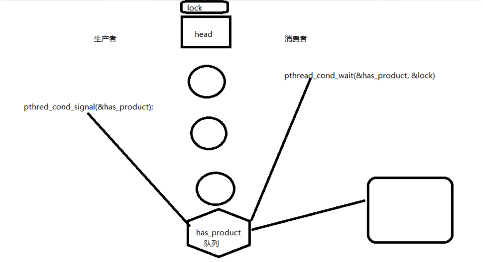
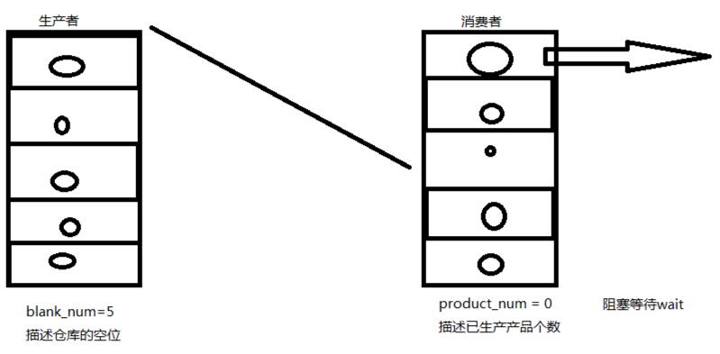
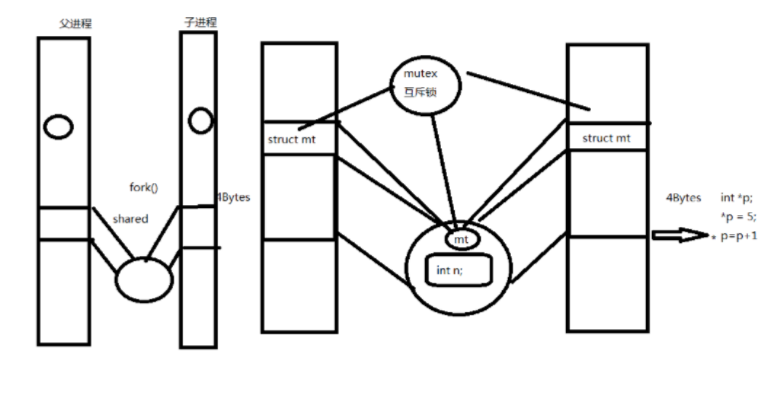

# linux系统编程-线程同步

## 线程同步

### 1.线程为什么要同步
多个线程同时访问共享数据时可能会冲突，比如两个线程都要把某个全局变量增加1，这个操作在某平台需要三条指令完成：
* 1.从内存读变量值到寄存器
* 2.寄存器的值加1
* 3.将寄存器的值写回内存

假设两个线程在多处理器平台上同时执行这三条指令，则可能导致下图所示的结果，最后变量只加了一次而非两次。
例子：创建两个线程，各自把counter增加5000次，正常情况下最后counter应该等于10000，但事实上每次运行该程序的结果都不一样，有时候数到5000多，有时候数到6000多。
```
#include <stdio.h>
#include <stdlib.h>
#include <pthread.h>
#define NLOOP 5000
int counter; /* incremented by threads */
void *doit(void *);
int main(int argc, char **argv)
{
pthread_t tidA, tidB;
pthread_create(&tidA, NULL, &doit, NULL);
pthread_create(&tidB, NULL, &doit, NULL);
/* wait for both threads to terminate */
pthread_join(tidA, NULL);
pthread_join(tidB, NULL);
return 0;
}
void *doit(void *vptr)
{
int i, val;
for (i = 0; i < NLOOP; i++) {
val = counter;
printf("%x: %d\n", (unsigned int)pthread_self(), val + 1);
counter = val + 1;
}
return NULL;
}
```
线程同步的原因
```
1.共享资源，多个线程都可对共享资源操作
2.线程操作共享资源的先后顺序不确定
3.处理器对存储器的操作一般不是原子操作
```

### 2.互斥量
mutex操作原语
```
pthread_mutex_t
pthread_mutex_init : 初始化锁
pthread_mutex_destroy ：释放锁
pthread_mutex_lock ：加锁
pthread_mutex_trylock ：尝试去获取锁（不会阻塞）
pthread_mutex_unlock ：解锁
```
函数原型
```
#include <pthread.h>
pthread_mutex_t mutex = PTHREAD_MUTEX_INITIALIZER; //当锁是全局变量时，需要这样来初始化。当为局部变量时需要init函数来初始化
int pthread_mutex_destroy(pthread_mutex_t *mutex);
int pthread_mutex_init(pthread_mutex_t *restrict mutex, const pthread_mutexattr_t *restrict attr);
int pthread_mutex_lock(pthread_mutex_t *mutex);
int pthread_mutex_trylock(pthread_mutex_t *mutex);
int pthread_mutex_unlock(pthread_mutex_t *mutex);
```
例子，这样运行结果就正常了，每次运行都能数到10000。
```
#include <stdio.h>
#include <stdlib.h>
#include <pthread.h>
#define NLOOP 5000
int counter; /* incremented by threads */
pthread_mutex_t counter_mutex = PTHREAD_MUTEX_INITIALIZER;
void *doit(void *);
int main(int argc, char **argv)
{
pthread_t tidA, tidB;
pthread_create(&tidA, NULL, doit, NULL);
pthread_create(&tidB, NULL, doit, NULL);
/* wait for both threads to terminate */
pthread_join(tidA, NULL);
pthread_join(tidB, NULL);
return 0;
}
void *doit(void *vptr)
{
int i, val;
for (i = 0; i < NLOOP; i++) {
pthread_mutex_lock(&counter_mutex);
val = counter;
printf("%x: %d\n", (unsigned int)pthread_self(), val + 1);
counter = val + 1;
pthread_mutex_unlock(&counter_mutex);
}
return NULL;
}
```

### 3.死锁
1.同一个线程在拥有A锁的情况下再次请求获得A锁.

2.线程一拥有A锁，请求获得B锁；线程二拥有B锁，请求获得A锁

### 4.读写锁

读共享，写独占
```
pthread_rwlock_t
pthread_rwlock_init
pthread_rwlock_destroy
pthread_rwlock_rdlock
pthread_rwlock_wrlock
pthread_rwlock_tryrdlock
pthread_rwlock_trywrlock
pthread_rwlock_unlock
```

例子：这样就会保证读取到的数据不会乱
```
#include <stdio.h>
#include <pthread.h>
int counter;
pthread_rwlock_t rwlock;
//3个线程不定时写同一个全局资源，5个线程不定时去读同一全局资源
void *th_write(void *arg)
{
    int t;
    while(1)
    {
        pthread_rwlock_wrlock(&rwlock);
        t = counter;
        usleep(100);
        printf("write %x : counter=%d ++counter=%d\n", (int)pthread_self(), t, ++counter);
        pthread_rwlock_unlock(&rwlock);
        usleep(100);
    }
}

void *th_read(void *arg)
{
    while(1)
    {
        pthread_rwlock_rdlock(&rwlock);
        printf("read %x : %d\n", (int)pthread_self(), counter);
        pthread_rwlock_unlock(&rwlock);
        usleep(100);
    }
}
int main(void)
{
    int i;
    pthread_t tid[8];
    pthread_rwlock_init(&rwlock,NULL);
    for (i=0; i<3; i++)
        pthread_create(&tid[i], NULL, th_write, NULL);
    for (i=0; i<5; i++)
        pthread_create(&tid[i+3], NULL, th_read, NULL);
    pthread_rwlock_destroy(&rwlock);
    for (i=0; i<8; i++)
        pthread_join(tid[i], NULL);
    return 0;
}
```

### 5.条件变量
条件变量给多个线程提供了一个汇合的场所,条件变量控制原语:
```
pthread_cond_t :
pthread_cond_init
pthread_cond_destroy
pthread_cond_wait ：等待某个条件成立
pthread_cond_timedwait ：按时间来等待()，等待的时长（如果说指定3分钟，那么3分钟后这个函数就出错返回）
pthread_cond_signal ：唤醒等待的线程（通知正在等待的线程），唤醒一个线程
pthread_cond_broadcast ：可以唤醒正在等待的所有线程。
```
生产者消费者模型：
生产者消费者模型：
```
#include <stdlib.h>
#include <pthread.h>
#include <stdio.h>

struct msg{
    struct msg *next;
    int num;
};

struct msg *head;
pthread_cond_t has_product = PTHREAD_COND_INITIALIZER; //定义一个条件变量
pthread_mutex_t lock = PTHREAD_MUTEX_INITIALIZER;  //互斥锁
/*条件变量一般和互斥锁来配合使用*/
void *consumer(void *p)
{
    struct msg *mp;

    for(;;){
        pthread_mutex_lock(&lock);
        /*
            pthread_cond_wait的作用：
            1.阻塞等待has_product被唤醒
            2.释放互斥锁，相当于调用：pthread_mutex_unlock
            3.当被唤醒时，解除阻塞，并且重新去申请获得互斥锁pthread_mutex_lock(&lock)
        */
        while(head == NULL) //如果head一直为NULL，则会继续依据第二个条件，将这把锁释放掉，让生产者能够生产
            pthread_cond_wait(&has_product, &lock);
        mp = head;
        head = mp->next;
        pthread_mutex_unlock(&lock);
        printf("consum %d\n", mp->num);
        free(mp);
        sleep(rand() % 5);
    }
}

void *producer(void *p)
{
    struct msg *mp;
    for(;;){
        mp = malloc(sizeof(struct msg));
        mp->num = rand() % 1000 + 1;
        printf("producer %d\n", mp->num);
        pthread_mutex_lock(&lock);
        //头插法
        mp->next = head;
        head = mp;
        pthread_mutex_unlock(&lock);
//pthread_cond_broadcast:唤醒等待的所有线程
        pthread_cond_signal(&has_product);//唤醒等待has_product的这个线程
        sleep(rand() % 5);
    }
}

int main(int argc, char *argv[])
{
    pthread_t pid, cid;

    srand(time(NULL));//生成一个随机数
    pthread_create(&pid, NULL, producer, NULL);
    pthread_create(&cid, NULL, consumer, NULL);
    pthread_join(pid, NULL);
    pthread_join(cid, NULL);
    return 0;
}
```


### 6.信号量
信号量控制原语
```
sem_t
sem_init
sem_wait  :类似于加锁，信号量减1加锁，获取信号量（获取一把锁，当减为0的时候，阻塞）
sem_trywait
sem_timedwait ：定时去获取锁
sem_post  ：解锁信号量加1
sem_destroy
```
生产者消费者例子：
```
#include <stdlib.h>
#include <pthread.h>
#include <stdio.h>
#include <semaphore.h>

#define NUM 5
int queue[NUM];
sem_t blank_number, product_number; //定义了两个 信号量
void *producer(void *arg)
{
    int p = 0;
    while(1)
    {
        //blank_number=5,获取一个锁，blank_number - 1
        sem_wait(&blank_number);  //获得锁 （类似于生产者有5把锁）
        queue[p] = rand() % 1000 + 1;
        printf("producer %d\n", queue[p]);
        //product_number = 0 => 1
        sem_post(&product_number); //释放锁，Product_number加1
        p = (p + 1)%NUM;
        sleep(rand()%5);
    }
}

void *consumer(void *arg)
{
    int c = 0;
    while(1)
    {
        sem_wait(&product_number); //如果是消费者先执行，则这里是不能执行的，初始值为0
        printf("consum %d\n", queue[c]);
        queue[c]=0;
        sem_post(&blank_number);  //
        c = (c+1)%NUM;
        sleep(rand()%5);
    }
}

int main()
{
    pthread_t pid, cid;
    sem_init(&blank_number, 0, NUM); //初始化，0表示默认属性
    sem_init(&blank_number, 0, NUM);
    pthread_create(&pid, NULL, producer, NULL);
    pthread_create(&cid, NULL, consumer, NULL);
    pthread_join(pid, NULL);
    pthread_join(cid, NULL);
    sem_destroy(&blank_number);
    sem_destroy(&product_number);
    return 0;
}
```
描述的模型：
信号量声明了这个仓库有多大。


### 7.进程间锁
进程间pthread_mutex， 默认是支持线程的
```
#include <pthread.h>
int pthread_mutexattr_init(pthread_mutexattr_t *attr);互斥锁属性Init
int pthread_mutexattr_setpshared(pthread_mutexattr_t *attr, int pshared);
int pthread_mutexattr_destroy(pthread_mutexattr_t *attr);
pshared:
线程锁：PTHREAD_PROCESS_PRIVATE
进程锁：PTHREAD_PROCESS_SHARED （进程之间的共享锁）
默认情况是线程锁
```

**注意（很重要）：在进程间加锁的时候必须是将锁加在磁盘文件上，然后用mmap映射到内存中，这样就是一把锁，如果直接声明一把锁，然后通过fork来创建子进程，那么这就相当于是两把锁。**

### 8.文件锁
使用fcntl提供文件锁,这个函数可以控制文件的访问控制属性
**man fcntl**
```
不仅可以锁住文件，而且可以锁住文件所在的区域，
struct flock {
...
short l_type; /* Type of lock: F_RDLCK,
F_WRLCK, F_UNLCK */ 读锁，写锁，解锁
short l_whence; /* How to interpret l_start:
SEEK_SET, SEEK_CUR, SEEK_END */  文件指针
off_t l_start; /* Starting offset for lock */
off_t l_len; /* Number of bytes to lock */
pid_t l_pid; /* PID of process blocking our lock
(F_GETLK only) */ 获取锁被哪个进程所持有
...
};
```
例子：
```
#include <stdio.h>
#include <sys/types.h>
#include <sys/stat.h>
#include <fcntl.h>
#include <unistd.h>
#include <stdlib.h>

void sys_err(char *str)
{
	perror(str);
	exit(1);
}
int main(int argc, char *argv[])
{
	int fd;
	struct flock f_lock;

	if (argc < 2)
	{
		printf("./a.out filename\n");
		exit(1);
	}

	if((fd = open(argv[1], O_RDWR)) < 0)
		sys_err("open");

	f_lock.l_type = F_WRLCK;
	f_lock.l_whence = SEEK_SET; //从文件的起始地址开始
	f_lock.l_start = 0;  //偏移量为0
	f_lock.l_len = 0;//0表示对整个文件加锁
	fcntl(fd, F_SETLKW, &f_lock);//关于F_SETLKW和F_SETLK：这两个的区别在于（F_SETLK）是阻塞的；（F_SETLKW）这个是非阻塞的
	printf("get flock\n");
	sleep(10);
	f_lock.l_type = F_UNLCK;  //解锁
	fcntl(fd, F_SETLKW, &f_lock);
	printf("un flock\n");

	close(fd);
	return 0;
}
测试的时候I可以开两个窗口，分别运行这个程序去获得这个文件，只有一个可以获得这个文件锁
```
锁的机制只是大家约定好的一套机制，如果你按上面的方案进行加锁，但是另一个人没有去按获取锁的方式，那也是可以写的。Linux下的是建议锁，不是全局锁（因为全局锁不是POSIX的标准）
